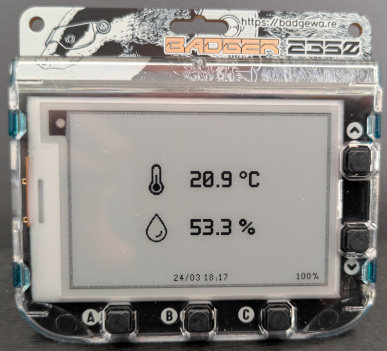
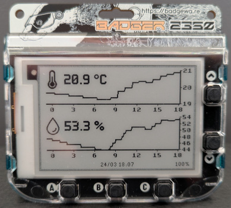
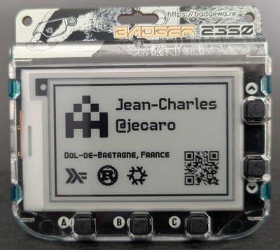
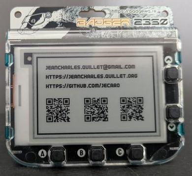

# Badger 2350 (personal fork)

My fork of the [Badger 2350 firmware](https://github.com/pimoroni/badger2350), 
with additional apps and a development environment.

## Apps

### mqttooth

<p align="center">
  
  
</p>

Simple dashboard to display current temperature and humidity. The badge 
connects via Bluetooth to [`mqttooth`](https://github.com/jecaro/mqttooth), a 
companion service that bridges MQTT sensors to BLE. See the `mqttooth` 
[README.md](https://github.com/jecaro/mqttooth/) for more information about the 
companion service and how to set it up.

The app in in: [./firmware/apps/mqttooth](./firmware/apps/mqttooth)

The app fetch periodically the temperature and humidity from the `mqttooth` 
service, and displays it on the badge. To save battery, it only refreshes the 
display if the change is significant. One can trigger a refresh by pressing the 
button `B`. The layout can be changed by pressing `Up` or `Down`.

### GitHub badge

<p align="center">
  
  
</p>

A personal GitHub badge, using QR codes to easily share information.

The app in in: [./firmware/apps/github](./firmware/apps/github)

## Development environment

The development environment is set up using nix flakes. It brings into scope 
`python`, `ruff` and `mpremote`. After installing `nix`, you can enter the 
development environment with:

```bash
$ nix develop
```

For a fast development cycle, I recommend using `mpremote` to interact with the 
device. First:
- plug your badger to your computer
- hit reset

Then, to run a python snippet on the device, you can use:

```
$ mpremote a0 exec "print('hello from badger')"
```

Or to run a single file app:

```
$ mpremote a0 run firmware/apps/badge/__init__.py
```
